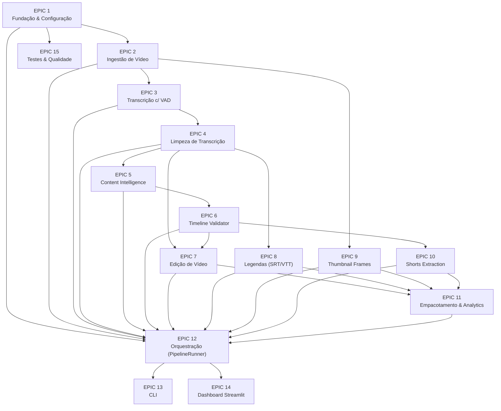

# Epics & Backlog — Pipeline de Pós-Produção com IA

> Derivado do **Documento de Desenvolvimento Completo v1.1 Consolidada** (compatível com ADR v3).
> Hardware-alvo: Ryzen 7 6000, GTX 1650 4GB, 32GB RAM, NVMe 1TB.
> Modelos homologados: faster-whisper `small` (GPU) | Qwen2.5 3B / Gemma 2 2B (CPU).
>
> Este documento reorganiza o Documento de Desenvolvimento Completo (que já é código-completo, seção por seção) em um artefato de **gestão de projeto**: Epics, User Stories, Backlog priorizado e ondas de entrega. Ele não substitui o documento técnico — é a camada de planejamento/acompanhamento sobre ele. Cada Epic referencia a seção correspondente do documento-fonte para rastreabilidade.

---

## Como ler este documento

- **Seção 1** — mapa de Epics e dependências.
- **Seção 2** — cada Epic com objetivo, escopo, Definição de Pronto e suas User Stories.
- **Seção 3** — backlog único, priorizado, com todas as stories em uma tabela (para quem gerencia o board).
- **Seção 4** — ondas de implementação recomendadas (grupos de Epics que podem ser entregues em sequência ou em paralelo).
- **Seção 5** — dívida técnica e riscos já conhecidos (herdados do Changelog v1.1 do documento-fonte).
- **Seção 6** — Definição de Pronto (DoR) e Definição de Feito (DoD) no nível do projeto inteiro.

---

## 1. Mapa de Epics e Dependências

Nota importante herdada da Seção 11 do documento-fonte: as Epics 8 (Legendas), 9 (Thumbnail Frames) e 10 (Shorts Extraction) são **mutuamente independentes** entre si (nenhuma lê a saída das outras — todas partem apenas de `cleaned.json`/`metadata.json`/`content.json`). O `PipelineRunner` (Epic 12) as executa **em paralelo via `ThreadPoolExecutor`**, não sequencialmente. Isso está refletido na Seção 4 (Ondas de Implementação) abaixo.

---

## 2. Epics Detalhadas

### EPIC 1 — Fundação & Configuração
*(Ref. documento-fonte: Seções 2, 3, 4, 5.1/5.7/5.8, 6, 7, 8)*

**Objetivo:** Estabelecer a base comum que todas as demais Epics dependem: estrutura de pastas, `config.yaml` único (formato flat), schemas base (`enums`, `state`, `analytics`), exceções, logging, Pre-Flight Check, banco SQLite (analytics-only), utilitários (hash, arquivo, tempo, slug) e os 3 prompts externos em `prompts/*.md`.

**Escopo:** `config/config.yaml`, `config/settings.py`, `.env.example`, `schemas/enums.py`, `schemas/state.py`, `schemas/analytics.py`, `shared/exceptions.py`, `shared/logging_config.py`, `shared/preflight.py`, `shared/db/database.py`, `shared/db/repositories.py`, `utils/hash_utils.py`, `utils/file_utils.py`, `utils/time_utils.py`, `utils/slugify.py`, `prompts/*.md`, `pyproject.toml`.

**Definição de Pronto:** `config.yaml` validado via Pydantic; Pre-Flight Check detecta corretamente FFmpeg/Ollama/modelos/disco/GPU ausentes; `PipelineState`/`StageResult` sobrevivem a um ciclo salvar→recarregar do disco sem perda/erro de tipo; `get_video_hash_from_id()` é a única fonte de verdade do hash em todos os agentes.

| ID | User Story | Prioridade |
|---|---|---|
| US-1.1 | Como desenvolvedor, quero um `config.yaml` único em formato flat validado por Pydantic, para não ter configuração dispersa entre `.env` e código. | Must |
| US-1.2 | Como usuário, quero que o Pre-Flight Check me avise claramente se FFmpeg, Ollama, os modelos ou espaço em disco estiverem faltando, antes de qualquer processamento começar. | Must |
| US-1.3 | Como desenvolvedor, quero uma função única `get_video_hash_from_id()` usada por todos os agentes, para eliminar o bug de cache-dir divergente (truncamento de hash inconsistente) identificado no Changelog v1.1. | Must |
| US-1.4 | Como desenvolvedor, quero `PipelineState`/`StageResult` sem `strict=True`, para que o round-trip disco→objeto (JSON sempre retorna strings) não quebre a coerção de `Path`/`datetime`. | Must |
| US-1.5 | Como desenvolvedor, quero os 3 prompts de sistema do LLM (`cleaning_llm.md`, `content_intelligence.md`, `thumbnail_prompt.md`) totalmente externos ao código, carregados em runtime. | Should |
| US-1.6 | Como desenvolvedor, quero exceções de domínio centralizadas em `shared/exceptions.py` (`PipelineError` como base), nunca redefinidas em outros módulos. | Must |
| US-1.7 | Como desenvolvedor, quero o SQLite usado **apenas** para analytics/histórico, nunca como fonte de verdade do progresso (isso é papel do cache em JSON). | Must |

---

### EPIC 2 — Ingestão de Vídeo
*(Ref.: Seção 9.1, 10.1)*

**Objetivo:** Extrair áudio WAV 16kHz mono e metadados do vídeo bruto via FFmpeg.

**Escopo:** `services/ffmpeg_service.py`, `agents/video_processing/agent.py`.

**Dependências:** Epic 1.

**Definição de Pronto:** `VideoIngestResult` preenchido corretamente para um vídeo de fixture; parsing de FPS via `fractions.Fraction` (não `eval()`, conforme correção de segurança do Changelog v1.1); vídeo sem trilha de áudio é rejeitado com erro claro.

| ID | User Story | Prioridade |
|---|---|---|
| US-2.1 | Como usuário, quero que o áudio seja extraído automaticamente do meu vídeo em formato compatível com o Whisper (16kHz, mono, WAV). | Must |
| US-2.2 | Como desenvolvedor, quero que o parsing de FPS use `fractions.Fraction` em vez de `eval()`, eliminando o risco de segurança identificado no Changelog v1.1. | Must |
| US-2.3 | Como usuário, quero receber um erro claro se meu vídeo não tiver trilha de áudio, em vez de uma falha silenciosa mais adiante no pipeline. | Should |

---

### EPIC 3 — Transcrição com VAD
*(Ref.: Seção 9.2, 10.2)*

**Objetivo:** Transcrever o áudio via `faster-whisper small` com VAD (Voice Activity Detection) obrigatório, liberando a VRAM da GPU ao final da etapa.

**Escopo:** `services/whisper_service.py`, `agents/speech_recognition/agent.py`.

**Dependências:** Epic 2.

**Definição de Pronto:** `TranscriptRaw` gerado com segmentos e timestamps corretos; VAD ativo por padrão (`vad_filter=True`, não configurável para desligar na V1); `unload_whisper_model()` chamado ao final da etapa, liberando VRAM — relevante para sessões longas do Streamlit onde o processo não reinicia entre vídeos.

| ID | User Story | Prioridade |
|---|---|---|
| US-3.1 | Como usuário, quero que meu áudio seja transcrito com marcação de tempo por trecho, usando o modelo `small` homologado para a GTX 1650 4GB. | Must |
| US-3.2 | Como usuário, quero que silêncio, música de fundo e ruído não gerem texto alucinado na transcrição (VAD obrigatório). | Must |
| US-3.3 | Como desenvolvedor, quero que a VRAM do Whisper seja liberada (`unload_whisper_model()`) ao final da etapa, para não vazar memória entre processamentos consecutivos no Streamlit. | Must |

---

### EPIC 4 — Limpeza de Transcrição
*(Ref.: Seção 10.3, Changelog v1.1 item 5)*

**Objetivo:** Limpar a transcrição em duas etapas — regex de lista fechada (remoção segura de preenchimentos vocais) seguido de LLM em **batches de 25 segmentos por chamada** (não mais 1 chamada por segmento), com checkpoint parcial para resiliência a falhas no meio do processamento.

**Escopo:** `agents/transcript_cleaner/agent.py`, `prompts/cleaning_llm.md`, `services/ollama_service.py`.

**Dependências:** Epic 3.

**Definição de Pronto:** Regex usa `\b` (word boundaries) e cobre apenas a lista fechada (`hum`, `ah`, `ahn`, `ãhn`, `ehm` — nunca `é`/`tipo`/`né`, que exigem contexto do LLM); processamento em batches de 25 segmentos; `cleaned.partial.json` permite retomar sem reprocessar tudo; validação anti-alucinação (50%-200% de variação de tamanho) antes/depois do LLM.

| ID | User Story | Prioridade |
|---|---|---|
| US-4.1 | Como desenvolvedor, quero que o regex de limpeza use apenas uma lista fechada de preenchimentos vocais com word boundaries, para nunca destruir palavras como "você é" ou "esse tipo de coisa". | Must |
| US-4.2 | Como usuário, quero que a limpeza via LLM processe em lotes de 25 segmentos por chamada, para que vídeos de 20-30 minutos sejam viáveis no hardware-alvo (CPU, Qwen2.5 3B) sem levar horas. | Must |
| US-4.3 | Como usuário, quero que um checkpoint parcial (`cleaned.partial.json`) seja salvo durante o processamento em lote, para não perder todo o progresso se o processo falhar no meio. | Should |
| US-4.4 | Como desenvolvedor, quero uma validação anti-alucinação (rejeitar limpezas com variação de tamanho fora de 50%-200%) para proteger contra reescrita indevida do LLM. | Must |
| US-4.5 | Como desenvolvedor, quero testes unitários específicos para o regex em português, cobrindo os casos de falso positivo já identificados. | Must |

---

### EPIC 5 — Content Intelligence
*(Ref.: Seção 10.4, prompts/content_intelligence.md)*

**Objetivo:** Gerar em **uma única inferência LLM** o conjunto completo de SEO (título/descrição/hashtags/capítulos), candidatos de Shorts, prompts de thumbnail e resumo — a partir dos segmentos com timestamps (não apenas texto puro).

**Escopo:** `agents/content_intelligence/agent.py`, `schemas/content.py`, `prompts/content_intelligence.md`.

**Dependências:** Epic 4.

**Definição de Pronto:** `ContentIntelligenceResult` retorna `seo`, `shorts` (lista), `thumbnail` (lista direta) e `summary` em uma resposta JSON estruturada única; o agente recebe segmentos com `start`/`end`/`text`, nunca apenas texto concatenado.

| ID | User Story | Prioridade |
|---|---|---|
| US-5.1 | Como usuário, quero receber título, descrição, hashtags, capítulos, candidatos de shorts, prompts de thumbnail e resumo, todos gerados a partir de uma única análise coerente do conteúdo. | Must |
| US-5.2 | Como desenvolvedor, quero que o agente receba a transcrição como segmentos com timestamps (não texto puro), para que o LLM consiga sugerir cortes de shorts e capítulos com precisão temporal real. | Must |
| US-5.3 | Como desenvolvedor, quero que a resposta do LLM seja validada contra o schema `ContentIntelligenceResult` com retry automático em caso de JSON malformado. | Should |

---

### EPIC 6 — Timeline Validator
*(Ref.: Seção 10.5)*

**Objetivo:** Validar e corrigir os timestamps produzidos pelo Content Intelligence antes que cheguem ao FFmpeg — duração de shorts, limites do vídeo, ordenação de capítulos.

**Escopo:** `agents/timeline_validator/agent.py`.

**Dependências:** Epic 5.

**Definição de Pronto:** Nenhum `ShortCandidate` ou `Chapter` inválido (fora dos limites do vídeo, duração fora de [15s, `max_duration_seconds`], overlap impossível, fora de ordem) chega às etapas seguintes; candidatos inválidos são descartados ou ajustados (clamp), com log de warning.

| ID | User Story | Prioridade |
|---|---|---|
| US-6.1 | Como desenvolvedor, quero um módulo dedicado que valide todos os timestamps do Content Intelligence antes de qualquer corte real de vídeo, isolando essa responsabilidade do agente de geração. | Must |
| US-6.2 | Como usuário, quero que candidatos de shorts com duração fora do intervalo permitido sejam automaticamente descartados ou ajustados, sem quebrar o pipeline. | Must |
| US-6.3 | Como usuário, quero que os capítulos de SEO estejam sempre em ordem crescente e dentro da duração real do vídeo. | Must |

---

### EPIC 7 — Edição de Vídeo
*(Ref.: Seção 10.6)*

**Objetivo:** Detectar silêncios/pausas na transcrição e cortar o vídeo via FFmpeg (tentando `-c copy`, com fallback para reencode).

**Escopo:** `agents/video_edit/agent.py`, `services/ffmpeg_service.py`.

**Dependências:** Epic 4 (transcrição limpa) e Epic 6 (se depender de candidatos validados; caso a detecção de silêncio seja independente do Content Intelligence, a dependência efetiva é só a Epic 4 — mantida aqui a Epic 6 como consta no mapa de dependências da Seção 1 por segurança de sincronismo de estado no `PipelineRunner`).

**Definição de Pronto:** Vídeo editado gerado sem cortar no meio de fala; nenhuma perda de sincronismo de áudio/vídeo; fallback de reencode funcional quando `-c copy` falhar.

| ID | User Story | Prioridade |
|---|---|---|
| US-7.1 | Como usuário, quero que os silêncios do meu vídeo sejam cortados automaticamente, sem cortar no meio de uma palavra falada. | Must |
| US-7.2 | Como desenvolvedor, quero que o corte tente `-c copy` primeiro (mais rápido) e caia para reencode apenas quando necessário. | Should |
| US-7.3 | Como usuário, quero que o corte não gere erro de sincronismo entre áudio e vídeo no resultado final. | Must |

---

### EPIC 8 — Legendas (SRT/VTT)
*(Ref.: Seção 10.7)*

**Objetivo:** Gerar arquivos de legenda `.srt` e `.vtt` a partir da transcrição limpa, com no máximo 4 palavras por linha (estilo redes sociais). **Burn-in no vídeo está fora do escopo da V1.**

**Escopo:** `agents/subtitle_styling/agent.py`.

**Dependências:** Epic 4.

**Definição de Pronto:** `.srt` e `.vtt` válidos, sincronizados, com quebras de linha respeitando o limite de palavras configurado; nenhuma etapa de burn-in é executada.

| ID | User Story | Prioridade |
|---|---|---|
| US-8.1 | Como usuário, quero receber arquivos `.srt` e `.vtt` prontos, com poucas palavras por linha, para aplicar em qualquer editor externo. | Must |
| US-8.2 | Como desenvolvedor, confirmo que burn-in de legenda no vídeo está fora do escopo da V1 — não implementar essa etapa. | Must |

---

### EPIC 9 — Thumbnail Frames
*(Ref.: Seção 9.4, 10.8)*

**Objetivo:** Extrair de 3 a 5 frames candidatos do vídeo original via OpenCV (heurística de histograma + nitidez/Laplaciano), como referência visual para os prompts de thumbnail gerados na Epic 5.

**Escopo:** `services/opencv_service.py`, `agents/thumbnail_frames/agent.py`.

**Dependências:** Epic 2 (vídeo original).

**Definição de Pronto:** 3 a 5 frames `.jpg` extraídos e salvos, com score de nitidez calculado para cada um.

| ID | User Story | Prioridade |
|---|---|---|
| US-9.1 | Como usuário, quero receber de 3 a 5 frames extraídos do próprio vídeo como ponto de partida visual para minha thumbnail. | Must |
| US-9.2 | Como desenvolvedor, quero que a seleção de frames combine mudança de cena (histograma) com nitidez (Laplaciano/blur), evitando frames borrados. | Should |

---

### EPIC 10 — Shorts Extraction
*(Ref.: Seção 10.9)*

**Objetivo:** Exportar cada `ShortCandidate` validado (Epic 6) como um arquivo `.mp4` vertical individual, via FFmpeg puro (sem MoviePy).

**Escopo:** `agents/shorts_extractor/agent.py`, `services/ffmpeg_service.py`.

**Dependências:** Epic 6.

**Definição de Pronto:** Um `.mp4` por candidato validado, em formato vertical, sem dependência de MoviePy.

| ID | User Story | Prioridade |
|---|---|---|
| US-10.1 | Como usuário, quero que cada candidato de short validado seja exportado como um vídeo vertical individual pronto para redes sociais. | Must |
| US-10.2 | Como desenvolvedor, quero que a exportação use apenas filtros FFmpeg (crop/pad), sem depender de MoviePy. | Must |

---

### EPIC 11 — Empacotamento & Analytics
*(Ref.: Seção 10.10, schemas/analytics.py)*

**Objetivo:** Consolidar todos os artefatos em `outputs/<video_id>/`, gerar `analytics.json` (métricas por etapa, shorts, thumbnails, tempo total) e um `report.md` + ZIP final.

**Escopo:** `agents/packaging/agent.py`, `schemas/analytics.py`.

**Dependências:** Epics 7, 8, 9, 10.

**Definição de Pronto:** `analytics.json` reflete corretamente `stages` (status/duração), métricas de shorts e thumbnails; `report.md` e ZIP gerados; nenhuma etapa com falha parcial é omitida do relatório.

| ID | User Story | Prioridade |
|---|---|---|
| US-11.1 | Como usuário, quero um relatório final (`analytics.json` + `report.md`) mostrando o que foi gerado e quanto tempo cada etapa levou. | Must |
| US-11.2 | Como usuário, quero receber um ZIP com todos os artefatos, pronto para baixar de uma vez. | Should |
| US-11.3 | Como desenvolvedor, quero que falhas parciais em qualquer etapa apareçam claramente no relatório, nunca omitidas. | Must |

---

### EPIC 12 — Orquestração (PipelineRunner)
*(Ref.: Seção 11, Changelog v1.1 itens 2 e 7)*

**Objetivo:** Executar as 10 etapas de agente em ordem fixa, com suporte a resume (`--from`), reprocessamento forçado (`--force`), e paralelismo real (`ThreadPoolExecutor`) para o grupo mutuamente independente (Legendas, Thumbnail Frames, Shorts Extraction).

**Escopo:** `pipeline/runner.py`.

**Dependências:** Todas as Epics 1 a 11.

**Definição de Pronto:** `state.stages` contém exatamente **uma** entrada por etapa executada (não duas — bug do Changelog v1.1 item 2, onde tanto o agente quanto o runner registravam o `StageResult`); o registro de `StageResult` é responsabilidade **exclusiva** do `PipelineRunner`, nunca dos agentes; o trio independente roda de fato em paralelo, reduzindo o tempo total no Ryzen 7 multi-core.

| ID | User Story | Prioridade |
|---|---|---|
| US-12.1 | Como desenvolvedor, quero que apenas o `PipelineRunner` registre `StageResult` no estado, eliminando a duplicação de registros que corrompia `analytics.json` (Changelog v1.1 item 2). | Must |
| US-12.2 | Como usuário, quero rodar o pipeline retomando de uma etapa específica (`--from`) sem reprocessar tudo do zero. | Must |
| US-12.3 | Como usuário, quero forçar o reprocessamento total quando necessário (`--force`), ignorando qualquer cache existente. | Must |
| US-12.4 | Como usuário, quero que Legendas, Thumbnail Frames e Shorts Extraction rodem em paralelo (não uma atrás da outra), já que não dependem entre si. | Should |
| US-12.5 | Como desenvolvedor, quero um teste de regressão que confirme que, após um `run()` completo, `state.stages` tem exatamente 1 entrada por etapa. | Must |

---

### EPIC 13 — CLI
*(Ref.: Seção 12)*

**Objetivo:** Entry point `main.py` com parsing de `--video`, `--from`, `--force`, `--verbose`, e códigos de saída corretos.

**Escopo:** `main.py`.

**Dependências:** Epic 12.

**Definição de Pronto:** `python main.py --video video.mp4` funciona ponta a ponta; códigos de saída documentados (0 sucesso, 1/2/3 conforme tipo de falha); `--help` funcional.

| ID | User Story | Prioridade |
|---|---|---|
| US-13.1 | Como usuário, quero rodar o pipeline inteiro com um único comando de terminal. | Must |
| US-13.2 | Como usuário/CI, quero códigos de saída diferenciados (0/1/2/3) para diferenciar sucesso de tipos distintos de falha. | Should |
| US-13.3 | Como usuário, quero flags `--from` e `--force` disponíveis também via CLI, com os mesmos exemplos de uso documentados na Seção 12.3 do documento-fonte. | Must |

---

### EPIC 14 — Dashboard Streamlit
*(Ref.: Seção 13)*

**Objetivo:** Interface single-page com abas Upload / Progresso / Resultados, exibindo transcrição, shorts (com preview de vídeo), thumbnails e download em ZIP.

**Escopo:** `app/streamlit_app.py`.

**Dependências:** Epic 12.

**Definição de Pronto:** As 3 abas funcionam ponta a ponta sem uso de terminal; download de ZIP funcional; preview de vídeo dos shorts funcional.

| ID | User Story | Prioridade |
|---|---|---|
| US-14.1 | Como usuário leigo, quero enviar meu vídeo, acompanhar o progresso e revisar os resultados, tudo pela mesma tela, sem terminal. | Must |
| US-14.2 | Como usuário, quero ver os shorts gerados com preview de vídeo e baixar tudo em um ZIP único. | Should |
| US-14.3 | Como usuário, quero ver a transcrição e os thumbnails extraídos diretamente na aba de resultados. | Should |

---

### EPIC 15 — Testes & Qualidade
*(Ref.: Seção 14, 15, 16 — itens de stack e viabilidade de hardware)*

**Objetivo:** Estrutura de testes (unitários, regressão, fixtures curtas), configuração de Ruff/pytest, e os 3 testes de viabilidade de hardware que precisam ser confirmados antes de considerar a V1 pronta.

**Escopo:** `tests/`, `pyproject.toml`.

**Dependências:** Epic 1 (paralela a todas as demais — deve crescer junto com cada Epic implementada).

**Definição de Pronto:** Cobertura mínima de 70% nos módulos críticos; nenhuma dependência proibida presente (`langgraph`, `moviepy`, `ffmpeg-python`, `redis`, `kubernetes`); os 3 testes de viabilidade de hardware abaixo confirmados manualmente no hardware real.

| ID | User Story | Prioridade |
|---|---|---|
| US-15.1 | Como desenvolvedor, quero fixtures de vídeo curtas (5s) para testar o `PipelineRunner` rapidamente. | Must |
| US-15.2 | Como desenvolvedor, quero confirmar que o Qwen2.5 3B responde em menos de 60s para um prompt de 2000 tokens no hardware-alvo. | Must |
| US-15.3 | Como desenvolvedor, quero confirmar que o faster-whisper `small` processa 30 min de áudio em menos de 5 min na GTX 1650. | Must |
| US-15.4 | Como desenvolvedor, quero confirmar que o FFmpeg corta silêncios de vídeo 1080p sem erro de sincronismo. | Must |
| US-15.5 | Como desenvolvedor, quero um teste de regressão para `PipelineState` (salvar → recarregar → todos os campos batem). | Must |
| US-15.6 | Como desenvolvedor, quero um teste de regressão para `get_video_hash_from_id(generate_video_id(...))` retornando exatamente o hash original. | Must |

---

## 3. Backlog Consolidado

Tabela única para uso em board (Kanban/Scrum). `Prioridade`: Must/Should/Could (MoSCoW). `Onda`: ver Seção 4. `Status`: todas as stories começam como `To Do` — atualize conforme o desenvolvimento avança.

| ID | Epic | User Story (resumo) | Prioridade | Onda | Status |
|---|---|---|---|---|---|
| US-1.1 | 1 | `config.yaml` único validado | Must | 1 | To Do |
| US-1.2 | 1 | Pre-Flight Check | Must | 1 | To Do |
| US-1.3 | 1 | `get_video_hash_from_id()` centralizado | Must | 1 | To Do |
| US-1.4 | 1 | `PipelineState`/`StageResult` não-strict | Must | 1 | To Do |
| US-1.5 | 1 | Prompts externos em `.md` | Should | 1 | To Do |
| US-1.6 | 1 | Exceções centralizadas | Must | 1 | To Do |
| US-1.7 | 1 | SQLite apenas para analytics | Must | 1 | To Do |
| US-2.1 | 2 | Extração de áudio WAV 16kHz mono | Must | 2 | To Do |
| US-2.2 | 2 | Parsing de FPS via `Fraction` | Must | 2 | To Do |
| US-2.3 | 2 | Erro claro sem trilha de áudio | Should | 2 | To Do |
| US-3.1 | 3 | Transcrição com `faster-whisper small` | Must | 2 | To Do |
| US-3.2 | 3 | VAD obrigatório | Must | 2 | To Do |
| US-3.3 | 3 | `unload_whisper_model()` ao final | Must | 2 | To Do |
| US-4.1 | 4 | Regex de lista fechada com word boundaries | Must | 2 | To Do |
| US-4.2 | 4 | LLM em batches de 25 segmentos | Must | 2 | To Do |
| US-4.3 | 4 | Checkpoint parcial `cleaned.partial.json` | Should | 2 | To Do |
| US-4.4 | 4 | Validação anti-alucinação (50%-200%) | Must | 2 | To Do |
| US-4.5 | 4 | Testes unitários de regex em PT-BR | Must | 2 | To Do |
| US-5.1 | 5 | Content Intelligence unificado (1 chamada) | Must | 3 | To Do |
| US-5.2 | 5 | Input com segmentos + timestamps | Must | 3 | To Do |
| US-5.3 | 5 | Validação de schema com retry | Should | 3 | To Do |
| US-6.1 | 6 | Timeline Validator dedicado | Must | 3 | To Do |
| US-6.2 | 6 | Descarte/clamp de shorts inválidos | Must | 3 | To Do |
| US-6.3 | 6 | Capítulos ordenados e dentro da duração | Must | 3 | To Do |
| US-7.1 | 7 | Corte de silêncio sem cortar fala | Must | 4 | To Do |
| US-7.2 | 7 | `-c copy` com fallback reencode | Should | 4 | To Do |
| US-7.3 | 7 | Sem erro de sincronismo A/V | Must | 4 | To Do |
| US-8.1 | 8 | Geração de `.srt`/`.vtt` | Must | 4 | To Do |
| US-8.2 | 8 | Confirmação: sem burn-in na V1 | Must | 4 | To Do |
| US-9.1 | 9 | Extração de 3-5 frames de thumbnail | Must | 4 | To Do |
| US-9.2 | 9 | Score de nitidez (Laplaciano) | Should | 4 | To Do |
| US-10.1 | 10 | Export de shorts verticais individuais | Must | 4 | To Do |
| US-10.2 | 10 | Sem dependência de MoviePy | Must | 4 | To Do |
| US-11.1 | 11 | `analytics.json` + `report.md` | Must | 5 | To Do |
| US-11.2 | 11 | ZIP final para download | Should | 5 | To Do |
| US-11.3 | 11 | Falhas parciais visíveis no relatório | Must | 5 | To Do |
| US-12.1 | 12 | `StageResult` registrado só pelo Runner | Must | 6 | To Do |
| US-12.2 | 12 | Resume via `--from` | Must | 6 | To Do |
| US-12.3 | 12 | Reprocessamento total via `--force` | Must | 6 | To Do |
| US-12.4 | 12 | Paralelismo do trio independente | Should | 6 | To Do |
| US-12.5 | 12 | Teste de regressão: 1 `StageResult` por etapa | Must | 6 | To Do |
| US-13.1 | 13 | Execução via `main.py` | Must | 7 | To Do |
| US-13.2 | 13 | Códigos de saída diferenciados | Should | 7 | To Do |
| US-13.3 | 13 | Flags `--from`/`--force` na CLI | Must | 7 | To Do |
| US-14.1 | 14 | Dashboard 3 abas (Upload/Progresso/Resultados) | Must | 7 | To Do |
| US-14.2 | 14 | Preview de shorts + download ZIP | Should | 7 | To Do |
| US-14.3 | 14 | Transcrição e thumbnails na aba de resultados | Should | 7 | To Do |
| US-15.1 | 15 | Fixtures de vídeo curtas (5s) | Must | contínua | To Do |
| US-15.2 | 15 | Qwen2.5 3B < 60s / 2000 tokens | Must | 0 (pré-req.) | To Do |
| US-15.3 | 15 | Whisper `small` < 5min / 30min áudio | Must | 0 (pré-req.) | To Do |
| US-15.4 | 15 | FFmpeg sem erro de sync | Must | contínua | To Do |
| US-15.5 | 15 | Regressão `PipelineState` round-trip | Must | 1 | To Do |
| US-15.6 | 15 | Regressão hash consistente | Must | 1 | To Do |

---

## 4. Ondas de Implementação Recomendadas

**Por que esta ordem:**

- **Onda 0 é obrigatória antes de qualquer código.** Se o Qwen2.5 3B não responder em <60s ou o Whisper `small` não processar 30 min em <5 min no hardware real, a arquitetura inteira precisa ser revista (ex. mover Content Intelligence para um provedor em nuvem gratuito, conforme já discutido) — melhor descobrir isso antes de escrever qualquer agente.
- **Onda 1 (Epic 1)** é pré-requisito de tudo — nenhuma outra Epic compila sem config/schemas/exceções.
- **Onda 2 (Epics 2→3→4)** é sequencial e obrigatória, sem atalho — cada uma depende estritamente da anterior.
- **Onda 3 (Epics 5→6)** também é sequencial entre si (Timeline Validator depende do output do Content Intelligence).
- **Onda 4 (Epics 7, 8, 9, 10) pode ser paralelizada entre desenvolvedores/agentes de código diferentes** — são as 4 Epics mais independentes entre si do projeto (a única depend. comum é a Onda 3 já estar pronta). Isso inclusive espelha o paralelismo real de execução que o `PipelineRunner` fará em produção com o trio Legendas/Thumbnails/Shorts.
- **Onda 5 (Empacotamento)** só faz sentido depois que todas as saídas da Onda 4 existirem.
- **Onda 6 (PipelineRunner)** deve ser a penúltima — ela integra literalmente todas as Epics anteriores; implementá-la antes significa integrar contra contratos ainda instáveis.
- **Onda 7 (CLI + Dashboard)** por último e em paralelo entre si — ambas são apenas "camadas de interface" sobre o que a Onda 6 já entrega.
- **Epic 15 (Testes) é contínua** — cresce junto com cada Epic implementada, não é uma fase isolada no fim (exceto os testes de regressão específicos do Changelog v1.1, alocados na Onda 1, e os testes de viabilidade de hardware, na Onda 0).

---

## 5. Dívida Técnica e Riscos Conhecidos

Herdado diretamente do Changelog v1.1 do documento-fonte — já **corrigido na especificação**, mas mantido aqui como registro de por que cada decisão existe, para não ser revertido acidentalmente por um agente de código futuro:

| # | Risco/Bug original (v1.0) | Correção aplicada (v1.1) | Epic responsável por não regredir |
|---|---|---|---|
| 1 | Cache dir divergente entre agentes (hash truncado em 8 vs. 16 chars) | `get_video_hash_from_id()` único, usado por todos os agentes | Epic 1 (US-1.3) |
| 2 | `StageResult` duplicado (agente + runner registravam) | Registro é responsabilidade exclusiva do `PipelineRunner` | Epic 12 (US-12.1, US-12.5) |
| 3 | `strict=True` rejeitando coerção `str→Path`/`datetime` ao recarregar cache | Removido de `PipelineState`/`StageResult` (mantido nos demais schemas) | Epic 1 (US-1.4, US-15.5) |
| 4 | `eval()` no parsing de FPS (risco de segurança) | Substituído por `fractions.Fraction` | Epic 2 (US-2.2) |
| 5 | 1 chamada LLM por segmento (inviável em CPU para 20-30min) | Batches de 25 segmentos + checkpoint parcial | Epic 4 (US-4.2, US-4.3) |
| 6 | Sem gestão de VRAM do Whisper (vazamento em sessões longas do Streamlit) | `unload_whisper_model()` ao final da etapa | Epic 3 (US-3.3) |
| 7 | Sem paralelismo entre etapas independentes (Legendas/Thumbnails/Shorts) | `ThreadPoolExecutor` no `PipelineRunner` | Epic 12 (US-12.4) |

**Risco em aberto, não coberto pelo Changelog v1.1:** dependência de que o hardware-alvo realmente atenda aos tempos esperados (Onda 0). Se não atender, a arquitetura de Content Intelligence local pode precisar de um fallback em nuvem gratuita (Groq/OpenRouter) — decisão já cogitada no ADR original mas fora do escopo desta V1.

---

## 6. Definição de Pronto (DoR) e Definição de Feito (DoD) do Projeto

**Definição de Pronto (Definition of Ready) — para uma User Story entrar em desenvolvimento:**
- A Epic à qual pertence já teve suas dependências (Seção 1) concluídas.
- O contrato Pydantic relevante (se houver) já está definido em `schemas/`.
- Existe fixture de teste disponível (vídeo curto) quando a story envolve processamento de mídia.

**Definição de Feito (Definition of Done) — para considerar a V1 inteira pronta:**
- Todos os itens do Checklist Final de Aprovação do documento-fonte (Seção 16) estão marcados.
- Os 3 testes de viabilidade de hardware (Onda 0) foram confirmados no hardware real.
- `pytest` roda com cobertura mínima de 70% nos módulos críticos, sem falhas.
- Nenhuma dependência proibida (`langgraph`, `moviepy`, `ffmpeg-python`, `redis`, `kubernetes`) presente no `pyproject.toml`.
- `python main.py --video <vídeo real>` roda ponta a ponta e gera todos os artefatos esperados em `outputs/<video_id>/`.
- O Dashboard Streamlit permite completar upload → processamento → revisão → download sem uso de terminal.

---

*Fim do documento — Epics & Backlog derivado do Documento de Desenvolvimento Completo v1.1 Consolidada.*
